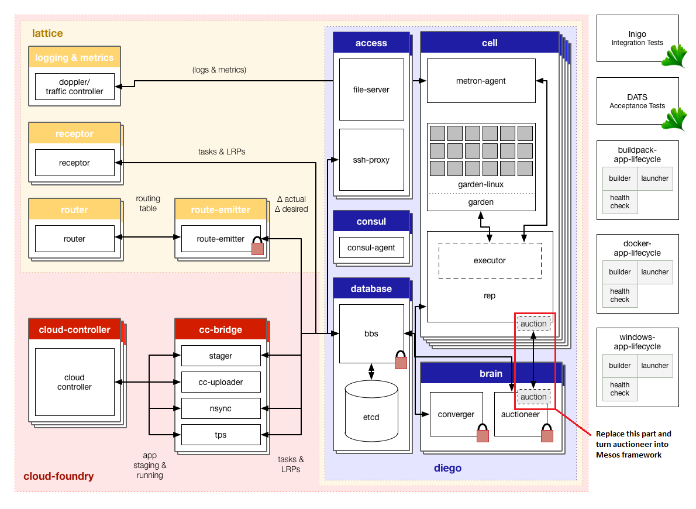

## CloudFoundry-Mesos

CloudFoundry-Mesos replaces the current auctioning process of CloudFoundry Diego with "Mesos Offers" and at the same time makes the Diego auctioneer component as a Mesos framework. This is a very initial version of the framework and is a work-in-progress. In the coming days and weeks, all of us as a community will keep refining these details as we go along. The main goal is to achieve “Improvements in Resource Management and Efficiencies as well as overall Scalability” across all applications frameworks, including Cloud Foundry PaaS environment. 

## Implementation

* __Create Mesos Scheduler and Executor__. The scheduler currently provides two strategies,
 `binpack` which tries to put CloudFoundry apps into as few cells as possible, and `spread` which is the opposite of `binpack`.
  Both of these scheduling strategies are based on the RAM usage and the implementation is simply for demo purpose at this time.
  The executor uses `rep` API to launch and monitor Diego `Tasks` and `LRPs`.
* __Package Diego `cell` into Docker image__ to minimize the Mesos Slave host system dependency and be able to create a cell on the fly.
  Due to `Garden-Linux` requirements, the Docker Container is started in privileged mode and uses the `host` networking.
  It also maps two directories for storing data and logs.
  The executor binary is packed together with the Diego Cell jobs (consul, metron, rep and garden) into this image as well.

    In the future, we are planning to __make Mesos [Garden](https://github.com/cloudfoundry-incubator/garden) aware__ so that Mesos can directly see the detail resource usage of each running garden container. There will be no need for nesting the Garden container within the Docker container.

* __Create a new `auctionrunner`__ that collects the `auctions` and hands them over to the Mesos scheduler.
* __Patch `auctioneer`__ by replacing the previous `auctionrunner` package.
* __Patch `rep`__ so the `/state` API would return not only `LRPs` but the `Tasks` as well (this is no longer needed in latest version of Diego).

## Key Features on Mesos

* __On-demand Resource Allocation__: CloudFoundry Diego cells are dynamically created and are removed if not needed.
* __Resource Sharing__: A common Mesos cluster can support multiple frameworks for various application types such as Hadoop, Spark, Redis, CloudFoundry, etc.
* __Scheduling Algorithm Customization__.
* __Mesos scales up to 10,000s of nodes__. This may help increase the CloudFoundry cluster size.

Please find the [demo video](https://youtu.be/2XZK3Mu32-s) on YouTube.

## Usage

To get up and running with CloudFoundry-Mesos, please follow the [Getting Started Guid](./docs/getting-started.md).

If you are not familiar with CloudFoundry or Mesos, the following documents would help:
* http://docs.cloudfoundry.org/
* https://github.com/cloudfoundry/cf-release/blob/master/README.md
* https://github.com/cloudfoundry-incubator/diego-release/blob/develop/README.md
* http://bosh.io/docs
* http://mesos.apache.org/documentation/latest/

## Future Work

* Garden as Mesos Containerizer
    * Garden container nested within Docker container may not be the right way
    * Granular resource monitoring
    * Requires Garden pre-installed in each Mesos slave
    * Probably requires to patch Diego `rep` and `executor`
* BTRFS=>AUFS transition in latest Garden Linux
    * AUFS requires kernel support
* Improve Error Handling
* Scheduling strategy and constrains and more
* Multiple RootFS support
* Test for performance and scalability
* Windows support?
* Put other Cloud Foundry components on Mesos?
    * Scale other CF components (such as `router` for example)

## Contributing
Contributions are welcome. Please refer to [CONTRIBUTING.md](./docs/CONTRIBUTING.md) for guidelines.